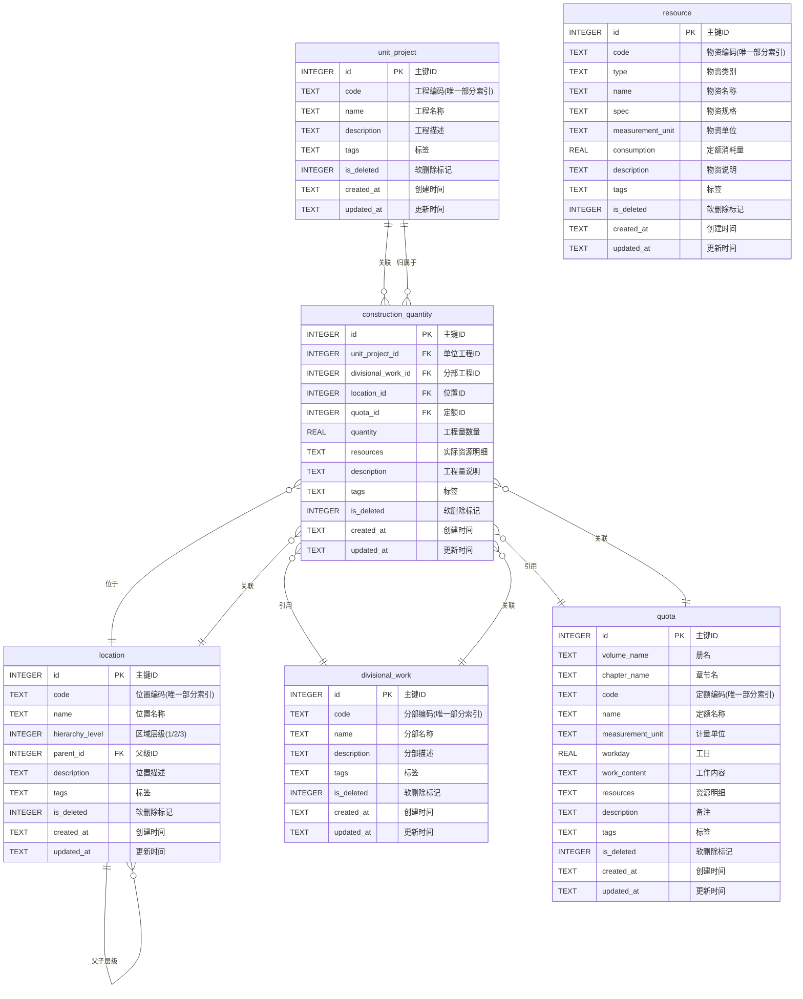

# 施工分页工程量统计软件数据库结构表

## 一、单位工程表（unit_project）

**功能**：存储项目整体信息，作为最高层级的数据容器，关联多个分部工程。

| 字段名（英文） | 字段名（中文） | 数据类型 | 是否必填 | 默认值            | 说明                                         |
| :------------- | :------------- | :------- | :------- | :---------------- | :------------------------------------------- |
| id             | 主键 ID        | INTEGER  | 是       | 自动递增          | 唯一标识，SQLite 自增主键                    |
| code           | 工程编码       | TEXT     | 是       | -                 | 单位工程唯一编码，不可重复，建议添加唯一索引 |
| name           | 工程名称       | TEXT     | 是       | -                 | 单位工程完整名称                             |
| description    | 工程描述       | TEXT     | 否       | NULL              | 项目概况、建设范围等说明                     |
| tags           | 标签           | TEXT     | 否       | NULL              | 用于分类筛选，多标签用逗号分隔               |
| is_deleted     | 软删除标记     | INTEGER  | 是       | 0                 | 0=未删除，1=已删除，实现数据逻辑删除         |
| created_at     | 创建时间       | TEXT     | 是       | CURRENT_TIMESTAMP | 记录数据创建时间，ISO 8601 格式              |
| updated_at     | 更新时间       | TEXT     | 是       | CURRENT_TIMESTAMP | 记录数据最后修改时间，ISO 8601 格式          |

**SQLite 建表语句**：

```sql
CREATE TABLE unit_project (
    id INTEGER PRIMARY KEY AUTOINCREMENT,
    code TEXT NOT NULL,
    name TEXT NOT NULL,
    description TEXT,
    tags TEXT,
    is_deleted INTEGER NOT NULL DEFAULT 0 CHECK (is_deleted IN (0, 1)),
    created_at TEXT NOT NULL DEFAULT (datetime('now')),
    updated_at TEXT NOT NULL DEFAULT (datetime('now'))
);

-- 索引
CREATE UNIQUE INDEX idx_unit_project_code ON unit_project(code) WHERE is_deleted = 0;
```

---

## 二、位置信息表（location）

**功能**：实现三级区域管理（1=楼栋 →2=层数 →3=房间），通过`parent_id`建立自引用层级关系。

| 字段名（英文）  | 字段名（中文） | 数据类型 | 是否必填 | 默认值            | 说明                                             |
| :-------------- | :------------- | :------- | :------- | :---------------- | :----------------------------------------------- |
| id              | 主键 ID        | INTEGER  | 是       | 自动递增          | 唯一标识，SQLite 自增主键                        |
| code            | 位置编码       | TEXT     | 是       | -                 | 三级区域统一编码，例如：楼栋-层数-房间，唯一索引 |
| name            | 位置名称       | TEXT     | 是       | -                 | 位置中文全称，便于人工识别                       |
| hierarchy_level | 区域层级       | INTEGER  | 是       | -                 | 1=楼栋，2=层数，3=房间，固定枚举值               |
| parent_id       | 父级 ID        | INTEGER  | 否       | NULL              | 关联本表`id`，实现层级关联（一级位置无父级）     |
| description     | 位置描述       | TEXT     | 否       | NULL              | 位置特性说明（如面积、用途）                     |
| tags            | 标签           | TEXT     | 否       | NULL              | 位置属性标签，多标签用逗号分隔                   |
| is_deleted      | 软删除标记     | INTEGER  | 是       | 0                 | 0=未删除，1=已删除                               |
| created_at      | 创建时间       | TEXT     | 是       | CURRENT_TIMESTAMP | 数据创建时间，ISO 8601 格式                      |
| updated_at      | 更新时间       | TEXT     | 是       | CURRENT_TIMESTAMP | 数据最后修改时间，ISO 8601 格式                  |

**SQLite 建表语句**：

```sql
CREATE TABLE location (
    id INTEGER PRIMARY KEY AUTOINCREMENT,
    code TEXT NOT NULL,
    name TEXT NOT NULL,
    hierarchy_level INTEGER NOT NULL CHECK (hierarchy_level IN (1, 2, 3)),
    parent_id INTEGER REFERENCES location(id) ON DELETE RESTRICT,
    description TEXT,
    tags TEXT,
    is_deleted INTEGER NOT NULL DEFAULT 0 CHECK (is_deleted IN (0, 1)),
    created_at TEXT NOT NULL DEFAULT (datetime('now')),
    updated_at TEXT NOT NULL DEFAULT (datetime('now'))
);

-- 索引
CREATE UNIQUE INDEX idx_location_code ON location(code) WHERE is_deleted = 0;
CREATE INDEX idx_location_hierarchy_level ON location(hierarchy_level) WHERE is_deleted = 0;
CREATE INDEX idx_location_parent_id ON location(parent_id) WHERE is_deleted = 0;
```

---

## 三、分部工程表（divisional_work）

**功能**：存储单位工程下的分部工程信息（如土建、水电、装修），关联多个定额数据。

| 字段名（英文） | 字段名（中文） | 数据类型 | 是否必填 | 默认值            | 说明                            |
| :------------- | :------------- | :------- | :------- | :---------------- | :------------------------------ |
| id             | 主键 ID        | INTEGER  | 是       | 自动递增          | 唯一标识，SQLite 自增主键       |
| code           | 分部编码       | TEXT     | 是       | -                 | 分部工程编码，建议添加唯一索引  |
| name           | 分部名称       | TEXT     | 是       | -                 | 分部工程名称                    |
| description    | 分部描述       | TEXT     | 否       | NULL              | 分部工程范围、技术要求说明      |
| tags           | 标签           | TEXT     | 否       | NULL              | 分部属性标签                    |
| is_deleted     | 软删除标记     | INTEGER  | 是       | 0                 | 0=未删除，1=已删除              |
| created_at     | 创建时间       | TEXT     | 是       | CURRENT_TIMESTAMP | 数据创建时间，ISO 8601 格式     |
| updated_at     | 更新时间       | TEXT     | 是       | CURRENT_TIMESTAMP | 数据最后修改时间，ISO 8601 格式 |

**SQLite 建表语句**：

```sql
CREATE TABLE divisional_work (
    id INTEGER PRIMARY KEY AUTOINCREMENT,
    code TEXT NOT NULL,
    name TEXT NOT NULL,
    description TEXT,
    tags TEXT,
    is_deleted INTEGER NOT NULL DEFAULT 0 CHECK (is_deleted IN (0, 1)),
    created_at TEXT NOT NULL DEFAULT (datetime('now')),
    updated_at TEXT NOT NULL DEFAULT (datetime('now'))
);

-- 索引
CREATE UNIQUE INDEX idx_divisional_work_code ON divisional_work(code) WHERE is_deleted = 0;
```

---

## 四、定额数据表（quota）

**功能**：存储定额模板数据

| 字段名（英文）   | 字段名（中文） | 数据类型 | 是否必填 | 默认值            | 说明                              |
| :--------------- | :------------- | :------- | :------- | :---------------- | :-------------------------------- |
| id               | 主键 ID        | INTEGER  | 是       | 自动递增          | 唯一标识，SQLite 自增主键         |
| volume_name      | 册名           | TEXT     | 是       | -                 | 定额所在册的名称                  |
| chapter_name     | 章节名         | TEXT     | 是       | -                 | 定额所在章的名称                  |
| code             | 定额编码       | TEXT     | 是       | -                 | 定额标准编码，建议添加唯一索引    |
| name             | 定额名称       | TEXT     | 是       | -                 | 定额对应的施工任务名称            |
| measurement_unit | 计量单位       | TEXT     | 是       | -                 | 定额计算单位                      |
| workday          | 工日           | REAL     | 否       | NULL              | 完成该任务所需工日                |
| work_content     | 工作内容       | TEXT     | 是       | -                 | 详细施工步骤与范围                |
| resources        | 资源明细       | TEXT     | 否       | NULL              | 所需材料/人工/机械，JSON 格式存储 |
| description      | 备注           | TEXT     | 否       | NULL              | 定额调整说明、特殊要求            |
| tags             | 标签           | TEXT     | 否       | NULL              | 定额属性标签                      |
| is_deleted       | 软删除标记     | INTEGER  | 是       | 0                 | 0=未删除，1=已删除                |
| created_at       | 创建时间       | TEXT     | 是       | CURRENT_TIMESTAMP | 数据创建时间，ISO 8601 格式       |
| updated_at       | 更新时间       | TEXT     | 是       | CURRENT_TIMESTAMP | 数据最后修改时间，ISO 8601 格式   |

**SQLite 建表语句**：

```sql
CREATE TABLE quota (
    id INTEGER PRIMARY KEY AUTOINCREMENT,
    volume_name TEXT NOT NULL,
    chapter_name TEXT NOT NULL,
    code TEXT NOT NULL,
    name TEXT NOT NULL,
    measurement_unit TEXT NOT NULL,
    workday REAL CHECK (workday IS NULL OR workday > 0),
    work_content TEXT NOT NULL,
    resources TEXT CHECK (resources IS NULL OR json_valid(resources)),
    description TEXT,
    tags TEXT,
    is_deleted INTEGER NOT NULL DEFAULT 0 CHECK (is_deleted IN (0, 1)),
    created_at TEXT NOT NULL DEFAULT (datetime('now')),
    updated_at TEXT NOT NULL DEFAULT (datetime('now'))
);

-- 索引
CREATE UNIQUE INDEX idx_quota_code ON quota(code) WHERE is_deleted = 0;
CREATE INDEX idx_quota_volume_chapter ON quota(volume_name, chapter_name) WHERE is_deleted = 0;
```

---

## 五、施工工程量表（construction_quantity）

**功能**：存储分页工程量具体数量，关联分部工程与具体位置，是分页工程量统计的核心表。

| 字段名（英文）     | 字段名（中文） | 数据类型 | 是否必填 | 默认值            | 说明                                 |
| :----------------- | :------------- | :------- | :------- | :---------------- | :----------------------------------- |
| id                 | 主键 ID        | INTEGER  | 是       | 自动递增          | 唯一标识，SQLite 自增主键            |
| unit_project_id    | 单位工程 ID    | INTEGER  | 是       | -                 | 外键，关联`unit_project`表`id`       |
| divisional_work_id | 分部工程 ID    | INTEGER  | 是       | -                 | 外键，关联`divisional_work`表`id`    |
| location_id        | 位置 ID        | INTEGER  | 是       | -                 | 外键，关联`location`表`id`           |
| quota_id           | 定额 ID        | INTEGER  | 是       | -                 | 外键，关联`quota`表`id`              |
| quantity           | 工程量数量     | REAL     | 是       | -                 | 该施工任务的工程量（如 10 套、20㎡） |
| resources          | 实际资源明细   | TEXT     | 否       | NULL              | 基于定额调整后的资源，JSON 格式      |
| description        | 工程量说明     | TEXT     | 否       | NULL              | 该施工任务的特殊说明（如调整原因）   |
| tags               | 标签           | TEXT     | 否       | NULL              | 多标签逗号分隔                       |
| is_deleted         | 软删除标记     | INTEGER  | 是       | 0                 | 0=未删除，1=已删除                   |
| created_at         | 创建时间       | TEXT     | 是       | CURRENT_TIMESTAMP | 数据创建时间，ISO 8601 格式          |
| updated_at         | 更新时间       | TEXT     | 是       | CURRENT_TIMESTAMP | 数据最后修改时间，ISO 8601 格式      |

**SQLite 建表语句**：

```sql
CREATE TABLE construction_quantity (
    id INTEGER PRIMARY KEY AUTOINCREMENT,
    unit_project_id INTEGER NOT NULL REFERENCES unit_project(id) ON DELETE RESTRICT,
    divisional_work_id INTEGER NOT NULL REFERENCES divisional_work(id) ON DELETE RESTRICT,
    location_id INTEGER NOT NULL REFERENCES location(id) ON DELETE RESTRICT,
    quota_id INTEGER NOT NULL REFERENCES quota(id) ON DELETE RESTRICT,
    quantity REAL NOT NULL CHECK (quantity > 0),
    resources TEXT CHECK (resources IS NULL OR json_valid(resources)),
    description TEXT,
    tags TEXT,
    is_deleted INTEGER NOT NULL DEFAULT 0 CHECK (is_deleted IN (0, 1)),
    created_at TEXT NOT NULL DEFAULT (datetime('now')),
    updated_at TEXT NOT NULL DEFAULT (datetime('now'))
);

-- 索引
CREATE INDEX idx_cq_unit_project_id ON construction_quantity(unit_project_id) WHERE is_deleted = 0;
CREATE INDEX idx_cq_divisional_work_id ON construction_quantity(divisional_work_id) WHERE is_deleted = 0;
CREATE INDEX idx_cq_location_id ON construction_quantity(location_id) WHERE is_deleted = 0;
CREATE INDEX idx_cq_quota_id ON construction_quantity(quota_id) WHERE is_deleted = 0;
CREATE INDEX idx_cq_unit_location ON construction_quantity(unit_project_id, location_id) WHERE is_deleted = 0;
```

---

## 六、物资表（resource）

**功能**：存储物资的模板数据，便于用户快速填入资源数据。应注意的是，物资表仅存储模板数据，用于定额及工程量模块的资源快速录入；未单独设计`quota_resource`关联表，核心原因是施工物资规格维度多（如铝合金百叶风口的长宽型号），提前全量录入易产生大量冗余相似数据，且无法覆盖用户非标录入场景。因此定额表、工程量表中的物资信息均以 JSON 格式存储，物资表仅作为参考模板使用。

| 字段名（英文）   | 字段名（中文） | 数据类型 | 是否必填 | 默认值            | 说明                            |
| :--------------- | :------------- | :------- | :------- | :---------------- | :------------------------------ |
| id               | 主键 ID        | INTEGER  | 是       | 自动递增          | 唯一标识，SQLite 自增主键       |
| code             | 物资编码       | TEXT     | 是       | -                 | 物资唯一编码，建议添加唯一索引  |
| type             | 物资类别       | TEXT     | 是       | -                 | 物资分类（主材/辅材/机械/人工） |
| name             | 物资名称       | TEXT     | 是       | -                 | 物资名称                        |
| spec             | 物资规格       | TEXT     | 否       | NULL              | 物资型号规格                    |
| measurement_unit | 物资单位       | TEXT     | 是       | -                 | 物资计量单位                    |
| consumption      | 定额消耗量     | REAL     | 否       | NULL              | 物资定额消耗量                  |
| description      | 物资说明       | TEXT     | 否       | NULL              | 物资特性说明、使用要求          |
| tags             | 标签           | TEXT     | 否       | NULL              | 多标签逗号分隔                  |
| is_deleted       | 软删除标记     | INTEGER  | 是       | 0                 | 0=未删除，1=已删除              |
| created_at       | 创建时间       | TEXT     | 是       | CURRENT_TIMESTAMP | 数据创建时间，ISO 8601 格式     |
| updated_at       | 更新时间       | TEXT     | 是       | CURRENT_TIMESTAMP | 数据最后修改时间，ISO 8601 格式 |

**SQLite 建表语句**：

```sql
CREATE TABLE resource (
    id INTEGER PRIMARY KEY AUTOINCREMENT,
    code TEXT NOT NULL,
    type TEXT NOT NULL CHECK (type IN ('主材', '辅材', '机械', '人工')),
    name TEXT NOT NULL,
    spec TEXT,
    measurement_unit TEXT NOT NULL,
    consumption REAL CHECK (consumption IS NULL OR consumption >= 0),
    description TEXT,
    tags TEXT,
    is_deleted INTEGER NOT NULL DEFAULT 0 CHECK (is_deleted IN (0, 1)),
    created_at TEXT NOT NULL DEFAULT (datetime('now')),
    updated_at TEXT NOT NULL DEFAULT (datetime('now'))
);

-- 索引
CREATE UNIQUE INDEX idx_resource_code ON resource(code) WHERE is_deleted = 0;
CREATE INDEX idx_resource_type ON resource(type) WHERE is_deleted = 0;
```

---

## 七、数据库实体 ER 关系图

### ER 图（Mermaid 格式）



### ER 图说明

**实体关系说明**：

1. **单位工程（unit_project）** 是顶层实体，通过 construction_quantity 表与其他实体关联
2. **分部工程（divisional_work）** 是独立的模板数据，可被多个工程量记录引用
3. **位置信息（location）** 实现三级区域管理（楼栋 → 楼层 → 房间），通过自引用建立层级关系
4. **定额数据（quota）** 是独立的模板数据，可被多个工程量记录引用
5. **施工工程量（construction_quantity）** 是核心业务实体，关联单位工程、分部工程、位置和定额
6. **物资表（resource）** 存储物资模板数据，独立于其他实体

**关系类型**：

- `||--o{` 一对多（One-to-Many）
- `}o--||` 多对一（Many-to-One）
- `||--||` 一对一（One-to-One）

---

### 📋 命名规范总结

**遵循的命名规范**：

1. ✅ 使用小写字母和下划线分隔（snake_case）
2. ✅ 外键字段采用 `关联表名_id` 格式（如 `unit_project_id`）
3. ✅ 布尔值使用 `is_` 前缀（如 `is_deleted`）
4. ✅ 时间戳使用 `_at` 后缀（如 `created_at`）
5. ✅ 名称简洁明了，避免冗余

---

## 数据完整性保证

### 1. 实体完整性

- ✅ 每个表都有主键 `id`
- ✅ 主键使用自增整数，保证唯一性

### 2. 参照完整性

- ✅ 外键关联设计合理
- ✅ 添加外键约束

### 3. 域完整性

- ✅ 使用适当的数据类型
- ✅ 设置了 NOT NULL 约束
- ✅ 设置了默认值
- ✅ 添加 CHECK 约束

### 4. 软删除设计

- ✅ 所有表包含 `is_deleted` 字段
- ✅ 查询时需要过滤 `WHERE is_deleted = 0`

---

## 附录：专业术语对照表

| 中文术语   | 英文字段名            | 说明                             |
| :--------- | :-------------------- | :------------------------------- |
| 单位工程   | unit_project          | 建筑工程的项目整体               |
| 分部工程   | divisional_work       | 单位工程下的分部（如暖通、电气） |
| 施工工程量 | construction_quantity | 具体施工任务的数量统计           |
| 定额       | quota                 | 施工定额标准数据                 |
| 物资       | resource              | 施工所需的材料、设备             |
| 工日       | workday               | 完成任务所需的工作日数           |
| 位置       | location              | 建筑物的位置层级信息             |
| 册         | volume_name           | 定额手册的册                     |
| 章         | chapter_name          | 定额手册的章                     |
| 规格       | spec                  | 材料或设备的规格型号             |
| 消耗量     | consumption           | 材料的定额消耗数量               |
